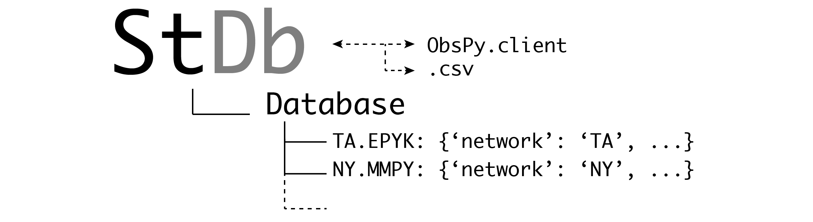

## StDb: Station Database Module and associated Tools

StDb is a package containing tools for building a database of station information
from geophysical observatories. The code is used through command-line scripts 
and include several options for querying an online fdsn archive, list 
the content of an existing station database, merge existing databases, and 
manually append new station information (e.g., for stations not hosted on
any fdsn archive). 

The resulting station dictionary is used in various seismic applications, 
such as [`SplitPy`](https://github.com/paudetseis/SplitPy), 
[`RfPy`](https://github.com/paudetseis/SplitPy), 
[`OrientPy`](https://github.com/nfsi-canada/OrientPy), and
[`OBStools`](https://github.com/nfsi-canada/OBStools).

Installation, Usage, API documentation and scripts are described at 
https://schaefferaj.github.io/StDb/.

Authors: [`Andrew Schaeffer`](https://schaeffer.ca) (Developer and Maintainer) & [`Pascal Audet`](https://www.uogeophysics.com/authors/admin/) (Contributor and Maintainer)

#### Contributing

All constructive contributions are welcome, e.g. bug reports, discussions or 
suggestions for new features. You can either 
[open an issue on GitHub](https://github.com/schaefferaj/StDb/issues) or 
make a pull request with your proposed changes. Before making a pull 
request, check if there is a corresponding issue opened and reference 
it in the pull request. If there isn't one, it is recommended to open 
one with your rationale for the change. New functionality or significant 
changes to the code that alter its behavior should come with corresponding 
tests and documentation. If you are new to contributing, you can open a 
work-in-progress pull request and have it iteratively reviewed.

