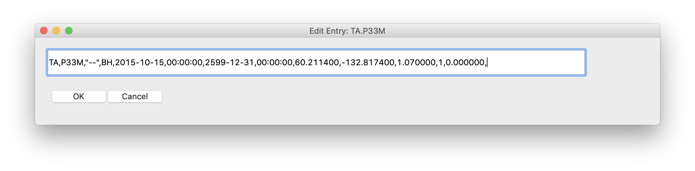

Edit Station Info
=================

Program ``edit_stdb``
---------------------

Description
-----------
Edit Station Database Dictionary contained in pickle file.

Usage
-----

.. code-block::

    $ edit_stdb -h
    Usage: edit_stdb [options] <station pickle file>

    Program to make basic modifications to a station database pickle file

    Options:
      -h, --help            show this help message and exit
      --keys=KEYS           Specify a comma separated list of keys to return.
                            These can be fragments of a key to include all keys
                            matching any fragment.
      -L, --long-keys       Specify Key format. Default is Net.Stn. Long keys are
                            Net.Stn.Chn
      -O OFILE, --output-file=OFILE
                            Specify an output file name for the edited database.
                            Default behaviour performs the changes in place on the
                            input file.
      -a, --ascii           Specify to write ascii Pickle files instead of binary.
                            Ascii are larger file size, but more likely to be
                            system independent.

Example
-------

Let's use the ``ta_table.pkl`` database generated in the example :ref:`query`.
To change only one station key, e.g., TA.P33M, and save it in a new database
``P33M.pkl`` type:

.. code-block::

    $ edit_stdb --keys=TA.P33M -O P33M.pkl ta_table.pkl

A GUI window will apear displaying the fields for the corresponding station key

Edit the field of interest and press the <OK> button. Pressing <Cancel> will iterate
to the next key specified - in this case it would simply quit the program since
there is only one key specified.

.. warning::

    Editing either the network code or station name can be hazardous since it also
    modifies the station key. If this happens, you will need to press <OK> twice to
    iterate to the next key.
